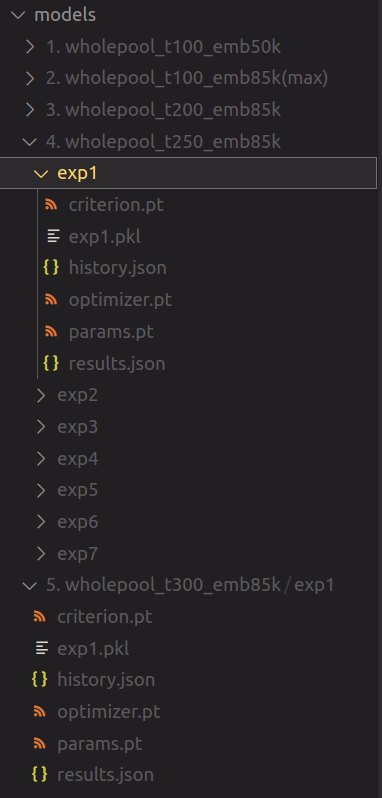

This is a sentiment analysis model for textual movie reviews trained with publicly available movie review data.

Two approaches have been tested - a CNN model and a Bag of Words model. The chosen and committed model is the Convolutional Neural Network built and trained in the `sentiment_classifier_cnn.ipynb` notebook. The other notebook (`bow_classifier.ipynb`) has also been included but is not part of the chosen approach.

The model can be found in the `model/` directory. Therein you will find the results on the test data.

## Data

The sentiment analysis model within this notebook uses publicly available datasets:

1. Large Movie Review Dataset: https://ai.stanford.edu/~amaas/data/sentiment/
2. Sentiment Polarity Dataset (v1 and v2): https://www.cs.cornell.edu/people/pabo/movie-review-data/
3. Rotten Tomatoes web scraped critic reviews: https://www.kaggle.com/datasets/stefanoleone992/rotten-tomatoes-movies-and-critic-reviews-dataset/

All of the data is saved in a top *data/* directory. All of the data was downloaded, unzipped and placed in this directory as is. The exact paths are specified in the *dataset_utils.py* script.

## Training your own models

To train your own models using this notebook, create a `models/` directory whose children are top-level experiment group directories. When this model was being trained, the experiment groups regarded the different approaches to pooling after the convolution operation as well as number of embeddings in the embedding layer. 

Creating and saving new models is enabled thanks the skorch callbacks API. Using the callbacks as defined in the training section of the notebook will automatically save the weights for the model and optimizer, as well as pickle the model.

The training directory structure will then look something like this:
